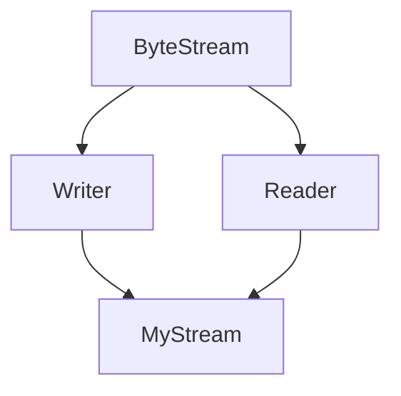

# 背景

起因是在写 CS144 的 lab0 时，看了一下 `ByteStream` 的声明（删去了一些无关的函数）：

```cpp
class Reader;
class Writer;

class ByteStream
{
public:
  explicit ByteStream( uint64_t capacity );

  Reader& reader();
  const Reader& reader() const;
  Writer& writer();
  const Writer& writer() const;

protected:
  // Please add any additional state to the ByteStream here, and not to the Writer and Reader interfaces.
  uint64_t capacity_;
  bool error_ {};
};

class Writer : public ByteStream { ... };

class Reader : public ByteStream { ... };
```

从继承关系看，`Writer` 和 `Reader` 是 `ByteStream` 的子类，那为什么 `ByteStream` 还需要有获取 `Writer` 和 `Reader` 的方法呢？

这就引出了接口隔离原则。

# 接口隔离

`Writer` 和 `Reader` 并非独立存在的类，而是 `ByteStream` 的"视图" (View)。

先看一下 `reader()` 的实现：

```cpp
Reader& ByteStream::reader()
{
  static_assert( sizeof( Reader ) == sizeof( ByteStream ),
                 "Please add member variables to the ByteStream base, not the ByteStream Reader." );
    //static_assert 确保 Reader 只是"视图"而非独立类——它不能有额外的成员变量

  return static_cast<Reader&>( *this ); // NOLINT(*-downcast)
}
```

返回的 `Reader` 对象内部实际引用的是同一个 `ByteStream`。也就是说，`Writer` 和 `Reader` 都是 `ByteStream` 的一部分——两者共享来自父类的函数，同时各自拥有独有的方法。

# 设计优势

这样设计的理由如下：

## 1. 共享状态

Reader 和 Writer 操作的是同一个缓冲区，只是提供不同的访问接口。

## 2. 接口隔离

每个接口只暴露相关的方法，保证了职责单一。

## 3. 避免菱形继承

如果使用继承来实现类似功能，会形成菱形继承结构：



这会导致问题：

```cpp
  class ByteStream {
  public:
      uint64_t capacity_ = 100;
      bool error_ = false;
  };

  class Writer : public ByteStream {
      // 继承 ByteStream，拥有自己的一份 capacity_ 和 error_
  };

  class Reader : public ByteStream {
      // 继承 ByteStream，拥有自己的一份 capacity_ 和 error_
  };

  // 危险！如果同时继承两者
  class MyStream : public Writer, public Reader {
      // 现在有两份 capacity_ 和 error_！
  };
```

菱形继承会导致 `MyStream` 中存在两份 `ByteStream` 的成员变量，破坏了状态的唯一性。